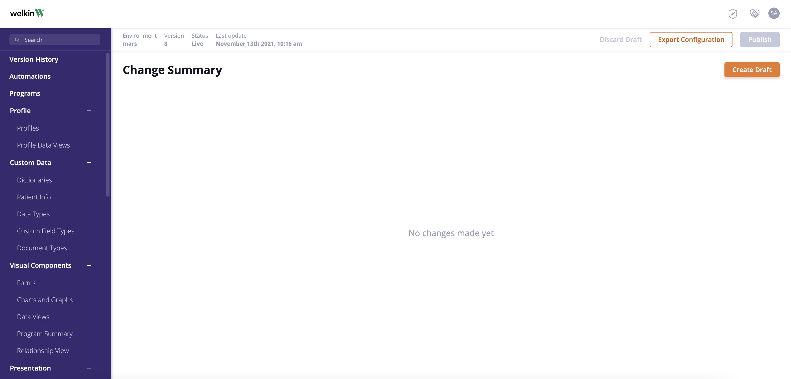

## How to use Welkin Health's v8 APIs using Python


This repository contains sample Python 3 code to connect to Welkin's v8 APIs.
You can use the example scripts to create and update records in your own Welkin environment.

For a detailed overview of our available API endpoints, please refer to the Welkin V8 API documentation.
[Welkin V8 Documentation](https://developers.welkinhealth.com/ "Welkin V8 Documentation")

---
###  Getting Started
#### Supported Python Versions
This library supports the following Python implementations:

- Python 3.6
- Python 3.7
- Python 3.8
- Python 3.9

Assuming that you have Python and virtualenv installed, set up your environment and install the required dependencies 
like this or you can install the library using pip:
```
$ git clone https://github.com/welkincloud-io/sample-apps.git
$ cd sample-apps
```
#### Mac/Unix
```
$ virtualenv venv
$ venv/Scripts/activate
$ pip install -r requirements.txt
```
#### Windows
```
$ virtualenv -p python3 venv
$ source venv/bin/activate
$ pip3 install -r requirements.txt
```
---

#### Creating API Client

You will need to set up an API Client to connect to your own Welkin organization.

1. Create an API client for your Organization
Navigate to Admin -> API Clients -> Create Client
Copy or download the Client Name and Secret Key
Navigate to the API Client page you created

2. Configure appropriate access for the client (Instance Access, Roles, Security Policies)
Just like a user account, the API Client needs to be granted access to view, create, or edit records.
Reminder: Security Policies and Roles are defined in the Designer and assigned in the Admin

For this example we will assume the Client Name is **VBOPNRYRWJIP** and the Secret Key is **+}B{KGTG6#zG%P;tQm0C**

---
### Configuration

The draft_config.json file should be used in designer 'create draft' configuration
1. Go to Change Summary - Create Draft



2. Choose from file and browse.


3. Choose draft_config.json file from root path of Sample app.


---
**Important :**
After loading draft configuration,  You need to set roles, primary role, policies, region and territories on Admin portal.
If you  don't have access to Admin portal then you can ask someone  with admin access to set this for you.

On Admin Portal
1.  API client -> <API-client-name> -> Accesses, Policies, Roles, Territories
-> Environment -> <Environment-name> -> Edit Client Security
2.  Users -> <User-Full-name> -> Accesses, Policies, Roles, Territories
-> Environment -> <Environment-name> -> Edit User Security

Admin Portal
https://admin.live.welkincloud.io/

---
Once you finish the steps, there are several variables in the URL structure we need to setup before using the scripts.

**Note: Set API client name, tenant name,
instance name, secret and environment(stg/live) in config.py file**

1. First variable is your Tenant (orgnization) name.

2.  Second variable is your API client name.
In order to Authenticate in Welkin, the client name and secret are required.

3.  Third variable is Instance (Environment) - This is a separate database inside a tenant.
    Typical customer will have 2-3 instances, representing customer development,
    testing and live environments, as you build out your Welkin care program.

4.  Fourth variable is the API Secret.

5.  Fifth varible is ENV which will represent testing or live environments.
    Its Value will be **stg** or **live**.

---

### How to use this Repository
1. Set values in config.py file
2. Generate token by running /utils/generate_token.py file.
3. Run Scripts by following instruction provided in docstring. There is a Json file with
the same name associated with each script. To customize the data to be loaded, edit the json file before running the script.

---
### Troubleshooting steps

A valid request to the Welkin API should return a 200 status code, indicating the request has succeeded.
If you receive an error code instead, the following troubleshooting steps may help.

#### 400 Bad Request
A 400 status code means that the server could not process an API request due to invalid syntax.
A few possibilities why this might happen are:
- A typo or mistake while setting config.py variables, such as mistyping the API client name, tenant name,
    instance name, secret or environment(stg/live). Check if any variable in the URL is showing a None value while running the script.

- A malformed JSON body, for example, missing a set of double-quotes or a comma, if your API request has a JSON body.

- Check if the request is missing authentication information, or the Authorization header provided could not be validated.
Make sure to run util/generate_token.py before running any script in this repo.

#### 401 Unauthorized

The 401 Unauthorized status code is returned when the API request is missing authentication credentials or
the credentials provided are invalid.

#### 403 Forbidden
The 403 Forbidden status code looks similar to the 401 code, but they shouldn't be confused with each other.

Usually, when you see the 403 status code, the API request that is being made includes some form of authorization. But, different from the 401 status code, the server does recognize the authorization credentials and accepts is as valid. The issue this time is that the authenticated user cannot access the resource for that endpoint. For example, the user might be trying to access account-level information that's only viewable by the account administrator, and the credentials being passed on the API request are for a regular user account.

Another reason this status code might be returned is if you did not request an API access token with the correct permissions.

To fix the API call for those two situations, make sure that the credentials you are using have the access level required by the endpoint, and the access token has the correct permissions.

A less common reason we might see this error is if we're not explicit about the Accept header value. Some APIs require you to include those headers on requests. That way, the server knows what information the client is sending, and also what format they expect to receive in return.

#### 404 Not Found
404 Not Found is one of those status codes that we don't have to be working with the APIs to see. But, specifically for APIs, it can usually mean a few different things:

- The endpoint does not exist

- The endpoint exists, but the resource cannot be found

- The endpoint exists and the resource can be found, but the user does not have the required permissions to access it, and so the server returns a 404 status code

For the first two cases, there's not much we can do as an API user, except double-check that the endpoint does exist in the documentation, and double-check that there are no misspellings or typos.

For the third case, the advice is similar to what we covered in the previous status code, 403. Make sure that the authorization credentials you are using actually have access to that endpoint, as some APIs might return a 404 error instead of 403.