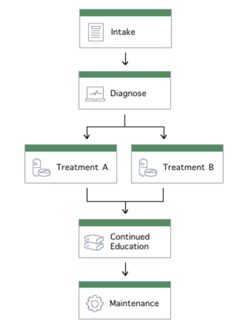

## Care Program and Phases
To create program we have to goto designer

#### 1. Patient creation
To create patient first you can browse to /scripts/ and edit the create_patient.json file by providing data,
then run create_patient.py file. If patient is already created you can skip this step.

#### 2. Assigning to a program
To assign created patient to a program edit /scripts/assign_to_program.json file then run assign_to_program.py file.
provide patient ID and program name in arguments.

#### 3. Assigning to a phase
To change phase of patient edit /scripts/assign_to_phase.json file then run assign_to_phase.py file.
provide patient ID and program name in arguments.

---
**Program Phases lifecycle**

This is sample care program. There are total 6 phases [intake, diagnose, treatment-a, treatment-b, continued-education, maintenance].
We can assign patient which is already assinged to program to any one phase from list. 

---
On Care Portal You can see the program and phase in patient profile - General Information 

### Troubleshooting steps 
...Work in progress
