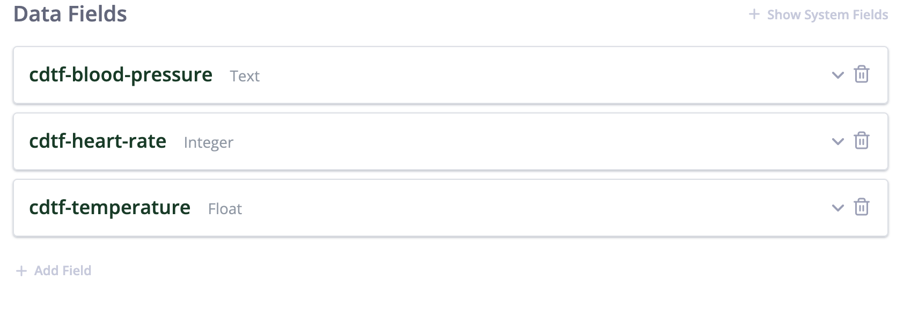

### Custom Data Types (CDT)
Custom data type records in Welkin are associated with Patients. In REST terms, they are a sub-resource to the patient object.

Each CDT has a set of system fields associated with it and a set of custom fields that you can add in Designer.

Welkin v8 API Documentation for CDTs:
https://developers.welkinhealth.com/#custom-data-types-cdt

**Note:  You can also watch Youtube video on [Designer- Forms &  Assessments](https://www.youtube.com/watch?v=vJf1WeVbGpw&t=92s&ab_channel=WelkinHealth)
for creating CDT's in Designer**
***
For this repository we have configured the following CDT record in Designer:

Request Body:

`{
    "cdtf-blood-pressure": "120/80",
    "cdtf-heart-rate": 72,
    "cdtf-temperature": 98.4
}`

Data types of Fields configured:

You can add and modify CDT records using our provided scripts.
***
### Working with CDT records
***

#### Description

Get all CDT records

#### HTTP Request
**GET** /{tenantName}/{instanceName}/patients/{patientId}/cdts/{cdtName}

In our example it would be:

**GET**  https://api.live.welkincloud.io/gh/sb-demo/patients/d6ea79ce-d3d6-4c2d-a27e-e4d1207f60f1/cdts/vitals

#### Parameters

| **Name** | **Located in** | **Description** |**Required**| **Type** |
|---|---|---|---|---|
|   patientId   |   path    |   ID of patient   |   Yes |   UUID    |
|   tenantName  |   path    |   Name of tenant|Yes|string|
|   instanceName    |   path    |   Name of instance|Yes|string|
|   cdtName |   path    |   Name of CDT |   Yes|    string|
|   fields|args |   : fields=name,phone |   No| string array|
|   page    |   args    |   page number|    No| integer|
|   size    |   args    |	page size   |  No    |   integer    |
|   sort    |   args    |	Sort field with sorting order(asc or desc) after coma   |  No    |   field,order    |
|   filters |   args    |	key=v1,v2,v3    |	No  |	key-value   |
|   dateStart   |   args    |	datetime in ISO-8601 format	|   No  |    datetime   |
|   dateEnd |   args    |	datetime in ISO-8601 format	|   No  |	datetime    |

#### Responses

| **Code** | **Description** |
|---|---|
| 200 | OK |
| 401 | Unauthorized |
| 403 | Forbidden |
| 404 | Not  Found |
***

#### Description
Get CDT record by identifier (id, external_id, external_guid)

#### HTTP Request
**GET** /{tenantName}/{instanceName}/patients/{patientId}/cdts/{cdtName}/{cdtRecordId}

In our example it would be:

**GET** https://api.live.welkincloud.io/gh/sb-demo/patients/d6ea79ce-d3d6-4c2d-a27e-e4d1207f60f1/cdts/vitals/8c0684ac-217e-45f4-8727-5587220dd512

#### Parameters
| **Name** | **Located in** | **Description** |**Required**| **Type** |
|---|---|---|---|---|
|  patientId | path  | ID of patient | Yes |	UUID  |
|  tenantName |	path | Name of tenant  | Yes |	string |
|  instanceName | path | Name of instance |	Yes | string |
|  cdtName | path |	Name of CDT | Yes |	string |
|  cdtRecordId | path |	Identifier of CDT record	| Yes |	UUID (type = ID or EGUID), String (type = EID)  |
| type |  query  |	Identifier type (ID, EID, EGUID), default ID | No |	String  |
***

#### Responses

| **Code** | **Description** |
|---|---|
| 200 | OK |
| 401 | Unauthorized |
| 403 | Forbidden |
| 404 | Not Found |

##### Examples

1. https://api.live.welkincloud.io/gh/sb-demo/patients/d6ea79ce-d3d6-4c2d-a27e-e4d1207f60f1/cdts/vitals/8c0684ac-217e-45f4-8727-5587220dd512
2. https://api.live.welkincloud.io/gh/sb-demo/patients/d6ea79ce-d3d6-4c2d-a27e-e4d1207f60f1/cdts/vitals/4a245aac-217e-45f4-8727-5587220dd512?type=EGUID
3. https://api.live.welkincloud.io/gh/sb-demo/patients/d6ea79ce-d3d6-4c2d-a27e-e4d1207f60f1/cdts/vitals/externalId?type=EID

***

#### Description

Create CDT record

#### HTTP Request
**POST** /{tenantName}/{instanceName}/patients/{patientId}/cdts/{cdtName}

In our example it would be:

**POST** https://api.live.welkincloud.io/gh/sb-demo/patients/d6ea79ce-d3d6-4c2d-a27e-e4d1207f60f1/cdts/{cdtName}

#### Parameters
| **Name** | **Located in** | **Description** |**Required**| **Type** |
|---|---|---|---|---|
| userId | path | ID of user | Yes | UUID |
| tenantName | path | Name of tenant | Yes | string |
| instanceName | path |	Name of instance | Yes | string |
| cdtName |	path | Name of CDT | Yes | string |

#### Responses

| **Code** | **Description** |
|---|---|
| 200 | OK |
| 401 | Unauthorized |
| 403 | Forbidden |
| 404 | Not  Found |
***

#### Description
Update CDT record by ID

#### HTTP Request
**PATCH**/{tenantName}/{instanceName}/patients/{patientId}/cdts/{cdtName}/{cdtRecordId}

In our example it would be:

**PATCH** https://api.live.welkincloud.io/gh/sb-demo/patients/d6ea79ce-d3d6-4c2d-a27e-e4d1207f60f1/cdts/vitals/8c0684ac-217e-45f4-8727-5587220dd512

#### Parameters
| **Name** | **Located in** | **Description** |**Required**| **Type** |
|---|---|---|---|---|
| userId | path | ID of user | Yes | UUID |
| tenantName | path | Name of tenant | Yes | string |
| instanceName | path |	Name of instance | Yes | string |
| cdtName |	path | Name of CDT | Yes | string |
| cdtRecordId |	path | ID of CDT record	| Yes | UUID |

#### Responses

| **Code** | **Description** |
|---|---|
| 200 | OK |
| 401 | Unauthorized |
| 403 | Forbidden |
| 404 | Not  Found |
***
#### Description
Bulk update CDT records. Allowed only for list fields with bulk edit flag

#### HTTP Request
**PATCH** /{tenantName}/{instanceName}/patients/{patientId}/cdts/{cdtName}

In our example it would be:

**PATCH** https://api.live.welkincloud.io/gh/sb-demo/patients/d6ea79ce-d3d6-4c2d-a27e-e4d1207f60f1/cdts/vitals

#### Parameters
| **Name** | **Located in** | **Description** |**Required**| **Type** |
|---|---|---|---|---|
| userId | path | ID of user | Yes | UUID |
| tenantName | path | Name of tenant | Yes | string |
| instanceName | path |	Name of instance | Yes | string |
| cdtName |	path | Name of CDT | Yes | string |

#### Responses

| **Code** | **Description** |
|---|---|
| 200 | OK |
| 401 | Unauthorized |
| 403 | Forbidden |
| 404 | Not  Found |
***
#### Description
Delete CDT record by ID

#### HTTP Request
**DELETE** /{tenantName}/{instanceName}/patients/{patientId}/cdts/{cdtName}/{cdtRecordId}

In our example it would be:

**DELETE** https://api.live.welkincloud.io/gh/sb-demo/patients/d6ea79ce-d3d6-4c2d-a27e-e4d1207f60f1/cdts/vitals/8c0684ac-217e-45f4-8727-5587220dd512

#### Parameters
| **Name** | **Located in** | **Description** |**Required**| **Type** |
|---|---|---|---|---|
| userId | path | ID of user | Yes | UUID |
| tenantName | path | Name of tenant | Yes | string |
| instanceName | path |	Name of instance | Yes | string |
| cdtName |	path | Name of CDT | Yes | string |
| cdtRecordId |	path | ID of CDT record	| Yes | UUID |

#### Responses

| **Code** | **Description** |
|---|---|
| 200 | OK |
| 401 | Unauthorized |
| 403 | Forbidden |
| 404 | Not  Found |
***

### Troubleshooting steps
...Work in progress
