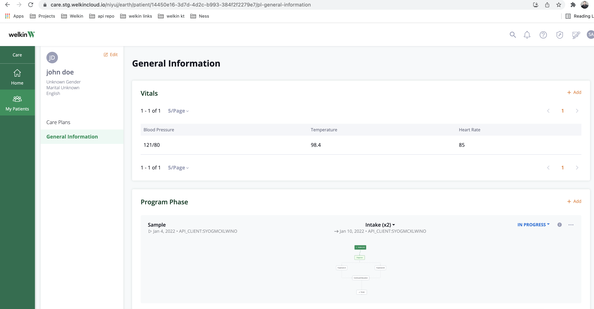
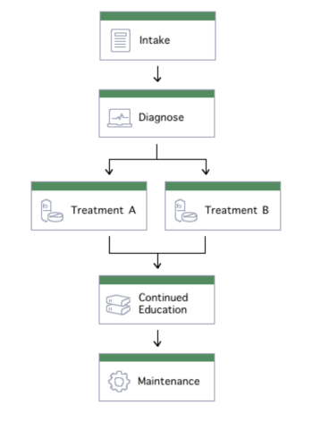
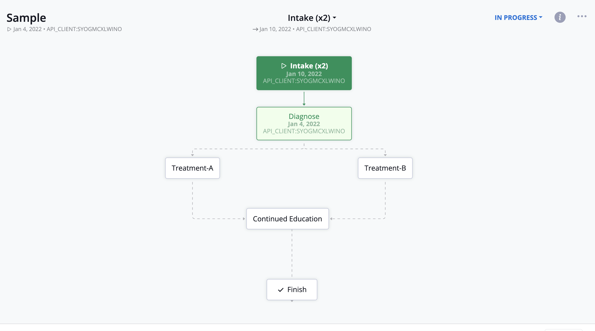

## Care Program and Phases
You can create the patient programs in Designer

#### 1. Patient creation
To create a patient using the API, browse to /scripts/ and edit the create_patient.json file with the desired patient information,
then run the create_patient.py script. If the patient is already created you can skip this step.

Image: Created patient on  Care portal

#### 2. Assigning to a program
To assign a patient to a program edit the /scripts/assign_to_program.json file then run the assign_to_program.py script, providing the patient ID and program name in the command-line arguments.

#### 3. Assigning to a phase
To change the phase of a patient edit /scripts/assign_to_phase.json file then run the assign_to_phase.py script, providing the patient ID and program name in the command-line arguments.

---
**Program Phases lifecycle**

In our sample care program referenced in this repository, there are 6 phases in total [intake, diagnose, treatment-a, treatment-b, continued-education, maintenance].
If a patient is already assigned to a program, we can assign that patient to any single phase from the list.

---
In the Care Portal, you can see the program and phase in the patient profile under General Information

