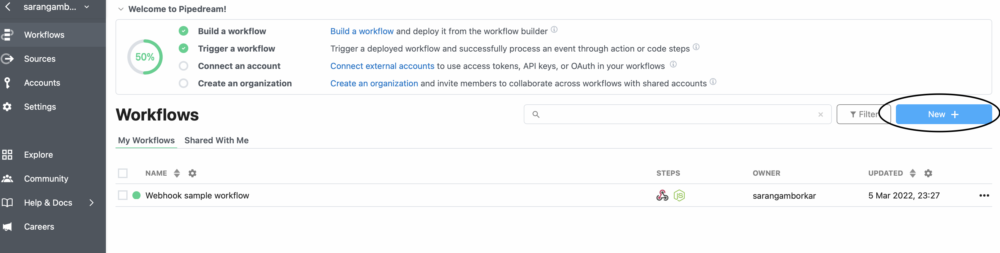
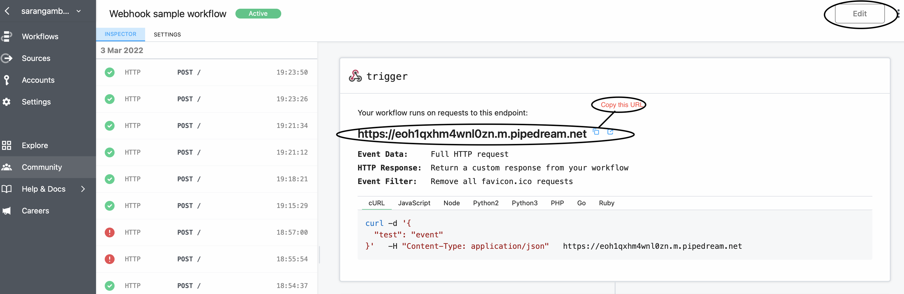
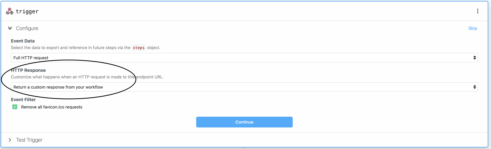
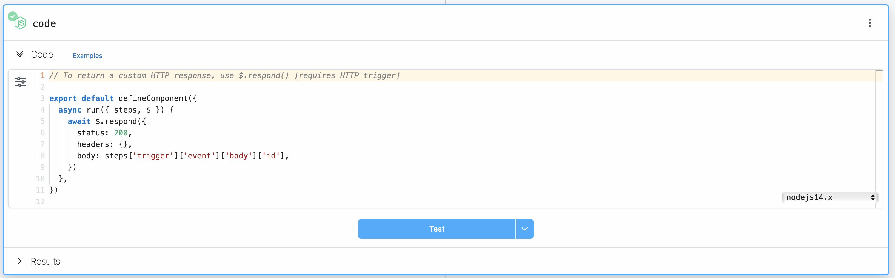
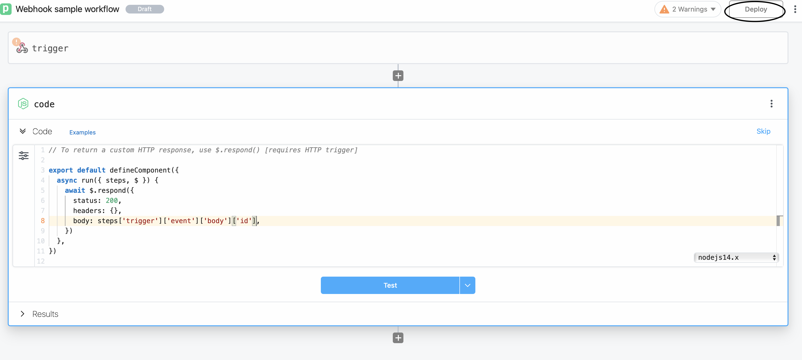

## Webhook

### What's a Webhook?
A webhook (also called a web callback or HTTP push API) is a way for an app to provide other applications with real-time information
Webhooks can be used by an external system for notifying your system about a certain event or update.

A webhook delivers data to other applications as it happens, meaning you get data immediately.
Unlike typical APIs where you would need to poll for data very frequently in order to get it real-time. 
This makes webhooks much more efficient for both provider and consumer.

### Consuming a Webhook
The first step in consuming a webhook is giving the webhook provider a URL to deliver requests to. 
This is most often done through a backend panel or an API. 
This means that you also need to set up a URL in your app that’s accessible from the public web.

---
## Testing Webhooks on Pipedream
At Pipedream, they process webhooks from every service that provides them. 
We usually write (Node) code to transform and act on these webhooks,
I’d like to show you what Pipedream is and how you can use it to run Node code on
any webhook or HTTP request.

Create account on 
[Pipedream](https://pipedream.com/), then create a workflow.

### What are Workflows?
A workflow is a linear sequence of steps (code, actions) triggered by some event, like an HTTP request.
Workflows make it easy to integrate your apps, data, and APIs - all with no servers or infrastructure to manage.

1.Create New workflow



2.Triggers

Triggers define the type of event that runs your workflow.
For example, HTTP triggers expose a URL where you can send any HTTP requests.
Pipedream will run your workflow on each request. 
The Cron Scheduler trigger runs your workflow on a schedule.
steps.trigger.event contains the event that triggered your workflow.

**Copy unique URL to use in script.**



3. Select "Customize what happens when an HTTP is made to this endpoint URL"






Also, this logic is all in a Node.js code step, 
so you can see how it works and easily customize the code based on your needs using Javascript.
```
// To return a custom HTTP response, use $.respond() [requires HTTP trigger]

export default defineComponent({
  async run({ steps, $ }) {
    await $.respond({
      status: 200,
      headers: {},
      body: steps['trigger']['event']['body']['id'],
    })
  },
})
```




---
#### How Pipedream handles JSON payloads

Pipedream optimizes for the case where you've sent JSON as the source event to a workflow.

When you send JSON in the HTTP payload, or when JSON data is sent in the payload from a webhook provider, 
Pipedream converts that JSON to its equivalent JavaScript object. 
The trigger data can be referenced using either event or the steps object.
You can confirm this JSON to JavaScript object conversion occurred by examining the event.inferred_body_type property.
If this is JSON, we correctly recognized the payload as such, and converted event.body to an object accordingly.

In the Inspector, we present event.body cleanly, indenting nested properties, to make the payload easy to read.
Since event.body is a JavaScript object, it's easy to reference and manipulate properties of the payload using dot-notation.


In workflows, Pipedream saves the raw payload data in a file whose URL you can reference in the variable steps.trigger.event.body.raw_body_url.

---
```
WARNING

The $.respond function is currently only available in Node.js (Javascript) workflow steps.
```

#### Errors with HTTP Responses
If you use \$.respond() in a workflow, you must always make sure \$.respond() is called in your code. If you make an HTTP request to a workflow, and run code where \$.respond() is not called, your endpoint URL will issue a 400 Bad Request error with the following body:
No \$.respond called in workflow

This might happen if:

You call \$.respond() conditionally, where it does not run under certain conditions.
Your workflow throws an Error before you run \$.respond().
You return data in the body property that isn't a string, object, or Buffer.

---

For More information please refer to [Pipedream Documentation](https://pipedream.com/docs/).
